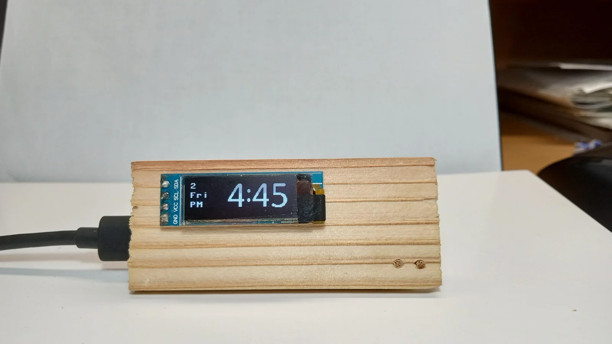

# simple_pico_clock

A simple Raspberry Pi Pico project of a digital clock using a 128x32 OLED display, coded in MicroPython

# How to Make the Clock
[My instructable]() shows steps to make this clock.

# Usage
Scrpits for the clock are in `src`. `src/main.py` contains all processins to display time, `src/digits.py` contains hexadecimal digit arrays to be displayed, and `src/ssd1306.py` is the ssd1306 driver from [stlehmann's micropython-ssd1306 fork](https://github.com/stlehmann/micropython-ssd1306/tree/master). 
> [!NOTE]
> ssd1306 is supposed to be included in [MicroPython's main repository](https://github.com/micropython/micropython/tree/master), but I'm having hard time finding it.

## Parameters in `src/main.py`
To run the script `main.py`, you need to set parameters bordered by `Parameters =======` in lines 10 to 33. The firs two parameters are I<sup>2</sup>C serial clock and data pins.These are GPIO numbers (labeled GP# in the [pinout](https://www.raspberrypi.com/documentation/microcontrollers/pico-series.html) 0 to 28), not pin numbers (1 to 40).
```python:src/main.py [10-11]
SCLpin = 3 # I2C clock pin assignment
SDApin = 2 # I2C data pin assignment
```

If your Pico board has a user-configurable button (not the BOOTSEL button, official Pico board doesn't have this but some alternative RP2040 boards do) or if you decided to add an external push button, then you need to set `timesetbutto = True` to enable the button and set the GPIO number for the button in `buttonpin`. Also set `buttontype = True` if the botton is pulled down (normally 0) or  `buttontype = False` if pulled up.
```python:src/main.py [13-15]
timesetbutton = True # True if using a push button for setting time, otherwise false (if false, set time by editing the settime variable below)
buttonpin = 24 # push button (for setting time) pin assignment
buttontype = False # True if the push button is pull down (normally 0), False if pull up (normally 1)
```

If you are not using a button to set time, then you need to set time in line 17. It takes a tuple of `(year,month,day,weekday,hour,minutes,second,sub-second)` with weekday being 0 for Moday, 1 for Tuesday etc.
```python:src/main.py [17]
settime = (2024,8,2,4,16,22,0,0) # Enter the time to be set here as a tuple (year,month,day,weekday(Monday=0),hour,minutes,second,sub-second)
```

In line 19, setting 'show24h = False' shows time in 12:00 format with AM/PM
In line 21, setting `mybirthday` to a tuple of `(month,date)` (e.g `(12,24)` for December 24) will show a little cake icon on that day to celebrate your birthday. Setting it to '(0,0)' disables this feature.

Daylight saving time can be set in lines 23 to 28:
```python:src/main.py [23-28]
autodsave = True # True to enable auto-correcting for daylight saving time (auto-correction is not executed when the script starts)
dsavestart = (3,6,2) # daylight saving time start date (month,weekday,weekday count from the beginning of month), for example, "second sunday in March" = (3,6,1)
dsaveend = (11,6,1) # daylight saving time end date (month,weekday,weekday count from the beginning of month), weekday is the index of the "weekdays" array
dsavetime = (2,0) # (hours,minutes), the starting and ending time of the daylight saving time
dsavehourshift = 1 # [hour], how many hours to shift by the daylight saving time
```


# Description of Code
SCLpin and SDApin are used to initialize the I<sup>2</sup>C instance, which is used to initialize ```SSD1306_I2C()``` instance
```python:src/main.py[124]
i2c = I2C(1,scl=Pin(SCLpin),sda=Pin(SDApin),freq=200000)
```
