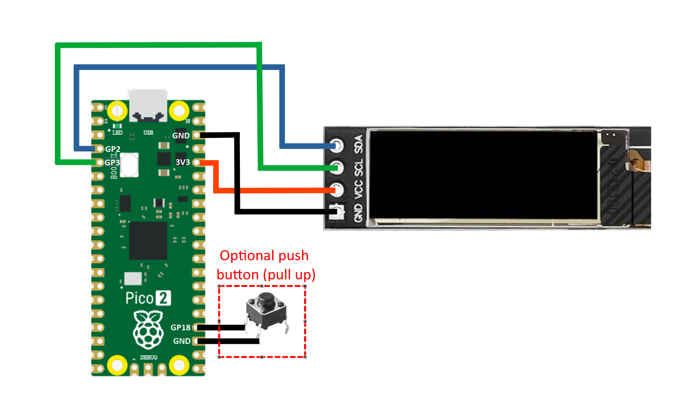
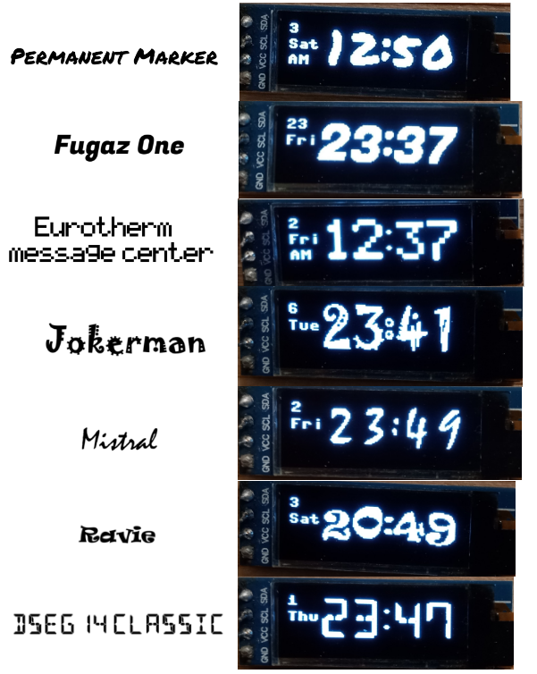

# simple_pico_clock

A simple Raspberry Pi Pico project of a digital clock using a 128x32 OLED display, coded in MicroPython

# How to Make the Clock

Wire a 128x32 I<sup>2</sup>C OLED clock and a push button (optional) to a Pico as shown above. For more details, see [my instructable](https://www.instructables.com/Simple-Pico-Clock/).

# Usage
To use the clock, you need ot upload three scripts in `/src` to your Pico. `src/main.py` contains all processins to display time, `src/digits.py` contains hexadecimal digit arrays to be displayed, and `src/ssd1306.py` is the ssd1306 driver from [stlehmann's micropython-ssd1306 fork](https://github.com/stlehmann/micropython-ssd1306/tree/master). 
> [!NOTE]
> ssd1306 is supposed to be included in [MicroPython's main repository](https://github.com/micropython/micropython/tree/master), but I'm having hard time finding it.

## Parameters in `src/main.py`
To run the script `main.py`, you need to set parameters bordered by `Parameters =======` in lines 10 to 33. The firs two parameters are I<sup>2</sup>C serial clock and data pins.These are GPIO numbers (labeled GP# in the [pinout](https://www.raspberrypi.com/documentation/microcontrollers/pico-series.html), 0 to 28), not pin numbers (1 to 40).
```python:src/main.py [10-11]
SCLpin = 3 # I2C clock pin assignment
SDApin = 2 # I2C data pin assignment
```

If your Pico board has a user-configurable button (not the BOOTSEL button, official Pico board doesn't have this but some alternative RP2040 boards do) or if you decided to add an external push button, then you need to set `timesetbutto = True` to enable the button and set the GPIO number for the button in `buttonpin`. Also set `buttontype = True` if the botton is pulled down (normally 0) or  `buttontype = False` if pulled up.
```python:src/main.py [13-15]
timesetbutton = True # True if using a push button for setting time, otherwise false (if false, set time by editing the settime variable below)
buttonpin = 24 # push button (for setting time) pin assignment
buttontype = False # True if the push button is pull down (normally 0), False if pull up (normally 1)
```

> [!IMPORTANT]
>If you are not using a button to set time, then you need to set time in line 17. It takes a tuple of `(year,month,day,weekday,hour,minutes,second,sub-second)` with weekday being 0 for Moday, 1 for Tuesday etc.
>```python:src/main.py [17]
>settime = (2024,8,2,4,16,22,0,0) # Enter the time to be set here as a tuple (year,month,day,weekday(Monday=0),hour,minutes,second,sub-second)
>```

In line 19, setting 'show24h = False' shows time in 12:00 format with AM/PM, and 'show24h = True' shows 13:00 to 23:59.

>[!Tip]
>In line 21, setting `mybirthday` to a tuple of `(month,date)` (e.g `(12,24)` for December 24) will show a little cake icon on the birthday. Setting it to '(0,0)' disables this feature.

Daylight saving time / summer time adjustment can be set in lines 23 to 28:
```python:src/main.py [23-28]
autodsave = True # True to enable auto-correcting for daylight saving time (auto-correction is not executed when the script starts)
dsavestart = (3,6,2) # daylight saving time start date (month,weekday,weekday count from the beginning of month), for example, "second sunday in March" = (3,6,1)
dsaveend = (11,6,1) # daylight saving time end date (month,weekday,weekday count from the beginning of month), weekday is the index of the "weekdays" array
dsavetime = (2,0) # (hours,minutes), the starting and ending time of the daylight saving time
dsavehourshift = 1 # [hour], how many hours to shift by the daylight saving time
```
'dsavestart' and `dsaveend` are tuples of month and week. For example, if the daylight saving time starts on the second sunday of March, then `dsavestart = (3,6,1)` where `3` for March, `6` for Sunday (`0` for Monday, etc.), and `1` for "second" Sunday (0 indexed, `0` for the "first" week of the month). `dsavetime` is the time that the daylight saving time starts/ends (e.g. `(2,0)` for 2:00 AM). `dsavehourshift` si the number of hours shift by daylight saving time (usually 1). Setting `autodsave = False` disables the daylight saving time auto-correction.

In line 33, `contrast = 200` (between 0 and 255) sets OLED display contrast.


# How to Set Time using a Push Button
To set time using a push bottn configured at `buttonpin`, first press and hold the button for 1 sec. This will display the following descriptions:
```
<1s press-> inc.
>2s press-> next
Press to start..
```
This means pressing the button shortly (< 1 sec) increments whatever entry you are setting by 1, and pressing and holding the button for more than 2 sec confirms the entry and goes to the next one. From this description, shortly pressing the button brings the day setting `Date: 2`. Shortly pressing the button increments to `Date: 3`. Shortly pressing the button at `Date: 31` circles back to `Date: 1`. Once date is set, pressing and holding the botton for more than two seconds proceeds to month setting, followed by year, weekday, hour, and minute.

>[!Tip]
>Date and year settings can be decremented by pressing and holding the button for more than 1 second and less than 2 seconds. The same button event increases the minutes setting by 10.

Long pressing the button (> 1 sec) at the description display enters the secondary setting, including 24h/12h display, birthday setting, and enabling/disabling daylight saving/summer time auto-correct.

# How to Make Custom Digits
You an make custom digits for hours and minutes to be displayed on the OLED. To do this, download the `/digits` folder with the file `digits/digit_converter.py` and the folder `digits/rawdigits`. `digits/rawdigits` contains 32x24 .png grayscale images of digits, which `digits/digit_converter.py` converts to hexadecimal arrays to be displayed by `src/main.py`. Edit these grayscale images in `digits/rawdigits` using a drawing app of your choice (e.g. Microsoft Paint). Once you are happy with digits you drew, change the working directory to the local `digits` directory and run `digits/digit_converter.py`. This will create a file `rawdigits/digits.py`, which stores hexadecimal arrays to be uploaded to your Pico. 

>[!Important]
>Running `digits/digit_converter.py` requires a Python 3 environment with NumPy `numpy` and OpenCV-Python `cv2`. You can get these libraries using `pip`.
>
Some example `digits.py` files for fonts shown below are in `/other_digits`. These fonts are drawn using Microsoft Paint.




# What `src/main.py` Does
The script uses RP2040's [internal Real Time Clock (RTC)](https://docs.micropython.org/en/latest/library/machine.RTC.html), accessed by `machine.RTC()` (line 128). It is not that accurate, so if you want a really accurate clock, you might want an external RTC module. The internal RTC is initialized by `machine.RTC.datetime(settime)` (line 129) where `(settime)` is a tuple of time (see "Important" section in [Parameters in `src/main.py`](#parameters-in-srcmainpy)).

SCLpin and SDApin are used to initialize the I<sup>2</sup>C instance `i2c = I2C(1,scl=Pin(SCLpin),sda=Pin(SDApin),freq=200000)` (line 124), which is used to initialize the ` SSD1306_I2C()` instance (line 125) that communicate with the OLED display over I<sup>2</sup>C to display time. 

Current time is acquired from the internal RTC using `machine.RTC.datetime()` (line 133). Lines 137 to 146 implement daylight saving/summer time quto-correct, and lines 149 to 181 displays the current time on the OLED module. The Pico then sleeps for 1 sec (line 183), and goes back to acquiring time in line 133.

Custom fonts for digits are stored in `digists.py` as hexadecimal arrays. These arrays can be formed by flattening a 32x24 binary pixel image of a digit in C-style (row-major) order and converting into a hexadecimal array with big-endian order (which `digits/digit_convertor.py` does). Lines 38 to 65 (in `main.py`) converts custom digit fonts defined in `digits.py` as hexadecimal arrays to `framebuf.FrameBuffer()` that can be sent to the OLED module to display custom digits using the `SSD1306_I2C.blit()` method. The function `givedbuff(num)` (lines 67 to 88) is just a convenience function that returns `framebuf.FrameBuffer()` array corresponding to `num`.

The function `buttonevent()` (lines 90 to 116) handles a button press event and returns the duration of the button press event. This function is used to set new time based on user input in lines 186 to 393.


